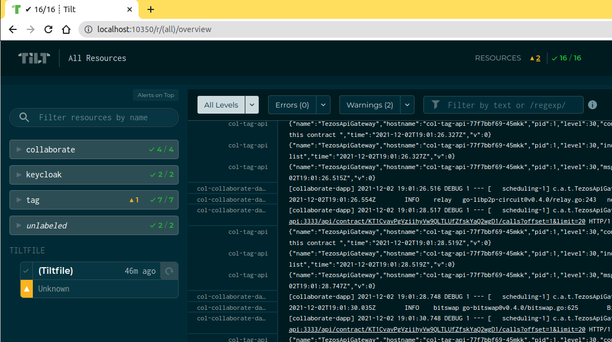

[](https://sonarcloud.io/dashboard?id=xdev-tech_collaborate)
[](https://sonarcloud.io/dashboard?id=xdev-tech_collaborate)
[](https://sonarcloud.io/dashboard?id=xdev-tech_collaborate)
[](https://sonarcloud.io/dashboard?id=xdev-tech_collaborate)
[](https://sonarcloud.io/dashboard?id=xdev-tech_collaborate)
[](https://sonarcloud.io/dashboard?id=xdev-tech_collaborate)
[](https://sonarcloud.io/dashboard?id=xdev-tech_collaborate)
[](https://sonarcloud.io/dashboard?id=xdev-tech_collaborate)
[](https://sonarcloud.io/dashboard?id=xdev-tech_collaborate)

# Collaborate

## Overall Solution

The main goal of Passport for Connected Car (PCC) is to bring more health to existing markets - for
example by ensuring the reliability of the residual value of the car on the second-hand market - but
it also opens up new opportunities by building the grounds for a large, secure, and fair market data
platform. Information that was previously collected individually in silos by each market
participant, can now be shared in a collaborative approach, allowing to build new services such as
pay-as-you-go insurance solutions, or predictive maintenance offers. The blockchain technology
ensures the security and sovereignty of the collected data, and allows an efficient and fair
re-distribution of the value created using tokens and will drive following benefits for the whole
ecosystem :

* Ensure end to end car data *certification and traceability* during whole car life cycle.
* Ease car technical *data exchange* between all the stakeholder.
* Enable *new services opportunities* such as predictive maintenance or pay how you drive insurance
  by leveraging certified data.

Streamline end user car passport application development enabling car data (administrative,
technical, regulatory) follow up and management.

## Leveraging The Blockchain Xdev - Passport for Connected Car

The ambition of this product is to foster collaboration within the digital asset ecosystem by
providing a backbone for all asset stakeholders implementing asset single source of truth, *GDPR
compliant data sharing* and built-in data monetization capabilities in order to improve asset supply
chain process and life cycle services by unleashing trustful data sharing.


Our solution can be understood in three layers: an *Enterprise Business Network*, A *Trustful Data
Protocol*, and the *Applications and Multi party Services Marketplace*. Each component plays a
distinct role allowing members to derive the most value for their businesses.

### Asset Enterprise Business Network

The foundation of the solution is its business network: from asset design to asset user or operator.
Each party shares information that can be tracked, stored and actioned across the platform
throughout an digital passport.

### Asset Data Protocol

Our solution Protocol is accessible via an open Application Programming Interface (API) and brings
together the business network through a set of open standards. Powered by blockchain technology, the
platform enables the industry to share information and collaborate securely.

### Asset Apps and Multiparty services

An open Applications and Multiparty Services Marketplace allows both consortium and third parties to
publish fit-for-purpose services atop the Protocol, fostering innovation and value creation.

## Technological orientations

The car data network and protocols are brought to life by many interacting software components,
organized in five layers: Application, Service, Access, Infrastructure, and Blockchain.


### Application Layer

The application layer is composed of the Passport APP and the Governance APP.

#### Passport APP

This application allows end-users to the consultation and the update of the passport conveyed by the
end-users.

Services accessible to end-user through this application are:

* Manage access right (grant/remove) to vehicle passport data.
* Find out the car’s authentic metric (i.e. odometer readings) at different times.
* Get an in-depth summary of the car health (accidents, damages)

#### Governance APP

This application is dedicated to the consortium members. It offers an interface and functionalities
for monitoring and managing platform data (e.g. data sources and data storage management, access
control, and monitoring of revenue related to data valuation).

### Service Layer

Several APIs will be provided :

* Asset-Vehicle life cycle API[^1] : Allows the creation, consultation and the update of the digital
  passport conveyed by digital passport owner or by any other asset stakeholder data provider (e.g.
  invoice to be added to a repair visit).

* Security API[^1] : This service, used by the platform users, offers mechanisms to manage
  identities and access control. Services accessible to end-user through this application are:
    * Identity Federation or Broker: An intermediary service that connects multiple service
      providers with different identity providers. As an intermediary service, the identity broker
      is responsible for creating a trust relationship with an external identity provider in order
      to use its identities to access internal services exposed by service providers.

* Partners API[^1] :provides an HTTP API to consortium members only, for interacting with data
  coming from the digital passport (on-chain) or directly from the system of another Partner
  system (off-chain). This process will be secured by token authorization mechanism.

* Analytics API[^1]:  Store (off-chain) and manage business KPI and analytic about the data assets
  available in the marketplace, like the digital passport.

* Data Marketplace API[^2]: provides an HTTP API to all network participants, for interacting with
  data coming from the digital passport (on-chain) or directly from the system of another Partner
  system (off-chain). This process will be secured by an end-to-end encryption environment. Services
  accessible to end-user through this application are:
    * Manage access right (grant/remove) to partner data.
    * Access anonymous data to analyze business performance. (i.e. number of accidents per vehicle
      brand, number of accidents by age rates).
    * Generated verified reports with their own data or supplement those reports with to PCC data to
      sell it in to other partners by using the marketplace.

* Governance API[^2]: allow the management of the Data platform and access control, accessible for
  the administrator profiles.

* Notification API[^2] : API that manages the interaction between the platform data and external
  consortium systems for full enterprise integration. The most basic scenario is to notify data
  owners on the activity of their data in real-time.

[^1]: MVP Perimeter
[^2]: Future version Perimeter

### Access Layer

This layer provides access mechanisms to the infrastructure layer for APIs of the service layer.

#### Data API Gateway

It provides mechanisms to access the data sources of all the consortium members and the Data Storage
of the same consortium member. In order to achieve interoperability and adaptability goals, several
connectors for the most common data sources ( Web Services, Relational Database, Files systems) are
provided. In order to guarantee the security and the privacy of the system, any data is duplicated,
notarization services based on fingerprint mechanism are used.

#### Custody API

It provides mechanisms to access the Key Storage and to sign blockchain transactions.

#### Policy Manager

It provides mechanisms for controlling access to data sources resources.

#### Blockchain API Gateway

It provides APIs to interact with the most common public blockchain: Tezos and Etherieum. It
includes services like

* Rest API for calling Smart contracts entry points
* Generic API for Transaction forge
* Generic API for Transaction submission using a pool of blockchain RPC gateways
* Generic API for Transaction Confirmation using a pool of indexer.

### Infrastructure Layer

All infrastructure components related to PCC platform are represented in this layer:

* Data cache and load management: Data from the Access layer is persisted into a local cache (Rabbit
  MQ, Local DB) for short durability and deleted after no more than X days. Business privacy
  contents are assured by Data encryption and Data partition by client channels.
* Decentralized File System: Some data will only store a fingerprint of its content in the
  smart-contrat and a link to get the data via a decentralized File System. So smart-contract
  storage size and cost can be reduced and each consumer would be able to ensure that data has not
  been maliciously altered.
* Key storage : Secure, store and tightly control access to tokens, passwords, certificates,
  encryption keys for protecting secrets and other sensitive data using an HTTP API.

### Blockchain Layer

#### Asset management Smart contracts

Four Main Smart contract for asset management are defined :

* Asset Digital Passport : define the set of data (or data model) as a Non Fungible token,
  implemented following the tezos FA 2.0)  which can be,
    * A simple and generic structure with a digital fingerprint of the asset data and metadata
      stored in a third party system. (blockchain-based timestamping)
    * A simple table of attributes of an asset. In the case of a car : Vin, Model, Color then will
      be stored in a common golden data (blockchain ledger) and a digital fingerprint of the asset
      metadata stored in a third party system (blockchain-based timestamping).
    * A more complex structure that represents the whole Life cycle of an Asset based on Event,
      Metric, etc. In the case of a car, Maintenance Event with Kilometer and Pieces state metrics.

* Asset Access Management smart contract : Asset Digital Passport is highly coupled with the Asset
  Access Management smart contract, composed of set of rules for ensuring compliance with GDPR
  regulation for vehicle passports data, like :
    * Role-based access management : Define Participants (parties) and their role over the Asset.
    * Consent Management : responsible for managing data owner personal data disposal policies and
      the corresponding consents, including generation, updates and duplication.
    * Data access registry : keep a full registry of data owner consent for data access and usage.

* Asset Monetization - PCC Token : smart contract for Asset data monetization defined as an tezos FA
  1.2 Utility token. These tokens will be associated, with Asset Digital Passport, for passport data
  exchange.

* Governance - Golden Token : smart contract enabling consortium members to manage the governance of
  the solution in proportion to their respective contributions.

For details about how Token will be used in the PCC platform, refer to section Use of tokens

## Solution Value Creation

### Use of tokens

In the context of the PCC solution, three distinct tokens are defined. This distinction ensures the
tokenization of the vehicle as an asset token, the management of the economic flows related to the
PCC solution's services thanks to a reward token, and the governance of the solution between the
industrial members on the other using a governance token.


#### Asset Token - PCC Vehicle Data Passport

The Asset Token is a digital token used to represent verifiable proofs of authenticity and ownership
of a real asset. In the case of complex real assets such as real estate or car, the asset token is a
non-fungible token composed of a set of data collected and handled by various stakeholders (issuer,
designer, suppliers) as depicted in table 1.

The concept of asset digital passport aim at gathering all verifiable and certified data describing
asset and associated management rules into one blockchain-based structure composed of:

* A Non-fungible token, following the standard FA1.2, representing the real asset and updated at
  each step of its lifecycle and composed by data collected, stored at each stakeholder data
  warehouse.
* An Asset Access Smart Contract defining conditions and rules for each asset stakeholder to certify
  access, authorization to use, or manage digital passport data. Taking into account, any usage of
  vehicle data must be compliant with GDPR regulations, the core part of this contract is the
  management of owner consent and complete access traceability.


#### Reward Token - PCC token

The PCC_Token is designed to allow both individual users and industrial members to:

* Value the creation and contribution to the Vehicle Passport application.
* Offer discounts or rewards for subscribing to services in exchange for sharing vehicle data.
* Ensure the distribution of the value of a service between the different contributors within the
  PCC platform.


The PCC_Token will be at the heart of new economic exchanges between vehicle owners or drivers and
the industrial stakeholders. All these new transactions will be based on the use of the vehicle's
passport app and access to new personalized services. Figure 12 (below) illustrates some scenarios
for using the PCC solution based on PCC_Token transactions.

#### Gouvernance Token - PCC Gold token

The PCC_Gold aims to enable consortium members t manage the governance of the solution in proportion
to their respective contributions by :

* Business network management: define Participants ( parties) and their role on the blockchain.
* Token management: Manage all operational and usage aspects of the PCC_Token, Asset token, and Gold
  token itself.

The PCC _Gold is used in all operations involving a collaborative decision. The decision-making
process requires the vote of each consortium member. To ensure a fair and equitable representation
of each consortium member, each voter's weight is proportional to the amount of PCC _Gold at his
disposal.


## API usages

The [Collaborate Open API](https://collaborate.api.bxdev.tech/) is updated after each merge on the
develop branch of the project repository.


### 1. Configuring data sources

**Data sources** is one of the core business concept the Collaborate project relies on. A Data
source is an external partner application that contains asset relative data. When a data source
owner wants to create NFT assets associated to a data source, he needs firstly to generate a http
router configuration file (aka A **data source configuration**, or
a [Traefik configuration](https://doc.traefik.io/traefik/)) by calling `POST /api/v1/datasource`.

During the creation, the owner provide **credentials** about the **authentication process** used to
access the data source. This information is cyphered and stored locally to be used when another
partner would like to access to this data source.

The data source configuration is stored in [IPFS](https://ipfs.io/) (a distributed file system), so
it could be used later by other partners to access to the NFT asset data hold by the data source.

[Scope](https://oauth.net/2/scope/) is another core business concept the data sources relies on.
Scopes are used to make able a data source to limit the resources a user can acces.

### 2. Creating NFT Token for assets

During the creation process, when it contains personal data the owner can flag the data source. This
flag is used to define the NTF minting workflow:


As you can see, the differences between digital passport for personal data and business dataset is:

* With personal data:
    * The data source owner needs to ask a user to consent to the **digital passport NFT** mint by
      calling `POST api/v1/digital-passport`.
    * The user can consent by calling `POST /api/v1/digital-passport/multisig/{contract-id}`. This
      consent triggers the digital-passport NFT mint, representing a user asset.
* With business dataset:
    * No consent is required, the owner mint directly a **business dataset NFT** for each scope of
      the created data source.

When a NFT is minted, it will contain metadata containing information about the data source it is
associated to: the **NFT Catalog**.


### 3. Consuming NFT Token associated data

Once again the workflow used to access NFT data contains in a data source depends on the kind of NFT
we want to access to:

* For digital passport: _Work In Progress_
* For business dataset:
    * The requester need to ask consent to the NFT data source owner. This can be done by
      calling `POST /api/v1/business-data/access-request`:
        * A transaction is made on an entry point of the smart contract.
        * The requested data source owner Collaborate instance:
            * is notified by watching the transaction made on the smart contract.
            * use the previously stored authentication process to generate access information (ex: a
              JWT on the required scope).
            * make a transaction on an entry point of the smart contract containing the cyphered
              access information.
        * The requester:
            * is notified by watching the transaction made on the smart contract.
            * decipher the access information
            * use the {data source configuration, access information} to access to the requested NFT
              related data source

#### Ciphering process:


#### Deciphering process:


## Run your environment

- [Install Docker](https://docs.docker.com/engine/install/#server):
    - [x] Ensure your docker service is available for your current user:`docker ps`.

      If the service is not available, please refer
      to [Docker post installation steps](https://docs.docker.com/engine/install/linux-postinstall/#manage-docker-as-a-non-root-user)
      .

      (!) Once you have added your user in the `docker` group, restarting your computer will ensure
      your user to access to the docker service.

- Install your local kubernetes cluster:
    - [Install clk k8s](https://github.com/click-project/clk_recipe_k8s).
    - Close and open a new terminal.
    - Execute the `clk k8s flow` command to create your cluster. It can take some minutes before
      ending with the following message:
      ```
      Ended executing the flow dependencies, back to the command 'flow'
      Everything worked well. Now enjoy your new cluster ready to go!
      ```
    - [x] Check that tilt has been installed by using `tilt version`: you should get a response
      like `v0.22.7, built 2021-09-03`.
    - [ ] Optionnaly you can setup [Lens](https://k8slens.dev/) to get additional information about
      your deployed K8S cluster
      

- [Install git](https://git-scm.com/downloads).

- Clone the Collaborate project
  repository: `git clone https://gitlab.com/xdev-tech/xdev-enterprise-business-network/collaborate.git`

- On Dev environements, [Tilt](https://docs.tilt.dev/) is used to simplify the containers
  orcherstration: go to the Collaborate project folder and run the application using the `tilt up`
  command, then press `space` key on your keyboard to
  open [Tilt in your browser](http://localhost:10350/r/(all)/overview).
- [x] Wait until all the Tilt resources get a green state. Warns (yellow state) could occurs but
  errors (red state) should not.
  _It will take time the first time to download all the project dependencies. You can stop the
  application by using the `tilt down` command_
  

## Accessing and testing the Collaborate application

The application is available on `https://col.localhost`. You can also access to
the [OpenAPI of your local instance](https://col.localhost/api/swagger-ui/index.html?configUrl=/api/api-docs/swagger-config)

A [Postman](https://www.postman.com/) collection can be imported to test the
API: [Collaborate.postman_collection.json](postman/Collaborate.postman_collection.json) . The most
relevant requests are defined under `dApp/Collaborate API` and `dApp/Keycloak API`.
_Other collection sub-folders are used during development to make developers able to interact with
underlying components._

Import also
the [col.localhost.postman_environment.json](postman/col.localhost.postman_environment.json)
environment

#### JWT

The API entry-points are restricted to specific roles (
cf. [Roles and permissions](https://xdevtechnologies.atlassian.net/wiki/spaces/DA/pages/513605692/GDPR+compliance#Roles-and-Permissions))
and so a [JWT](https://jwt.io/) has to be used as a _Bearer Token_. You can get a token by calling
the Security API: use the predefined Postman
request `Collaborate/Keycloak API/Get Token - Sam - DSP Admin`. Postman will automatically keep the
JWT and reuse it in further predefined requests.


## Troubleshooting

### CLK K8S: ModuleNotFoundError: No module named 'distutils.cmd'

If you get the following error message while installing clk K8S:

```
ModuleNotFoundError: No module named 'distutils.cmd'
installing pip... done
Traceback (most recent call last):
  File "<string>", line 3, in <module>
ModuleNotFoundError: No module named 'pip'
Error: we could not install a suitable pip version...
```

Then, execute the `apt-get install python3-distutils` command and execute
again `curl -sSL https://clk-project.org/install.sh | env CLK_EXTENSIONS=k8s bash`
