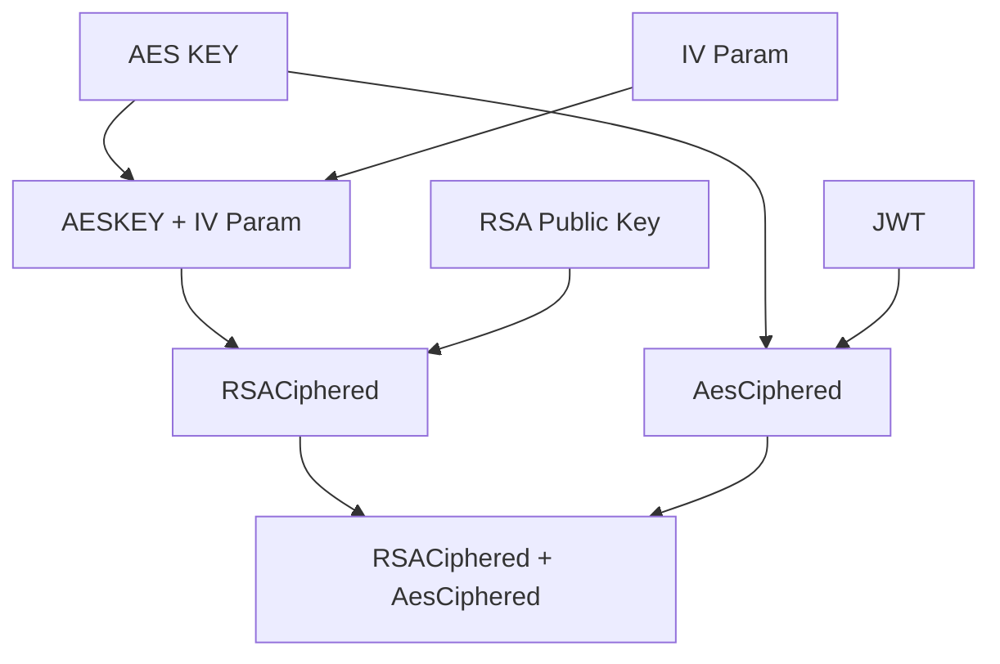
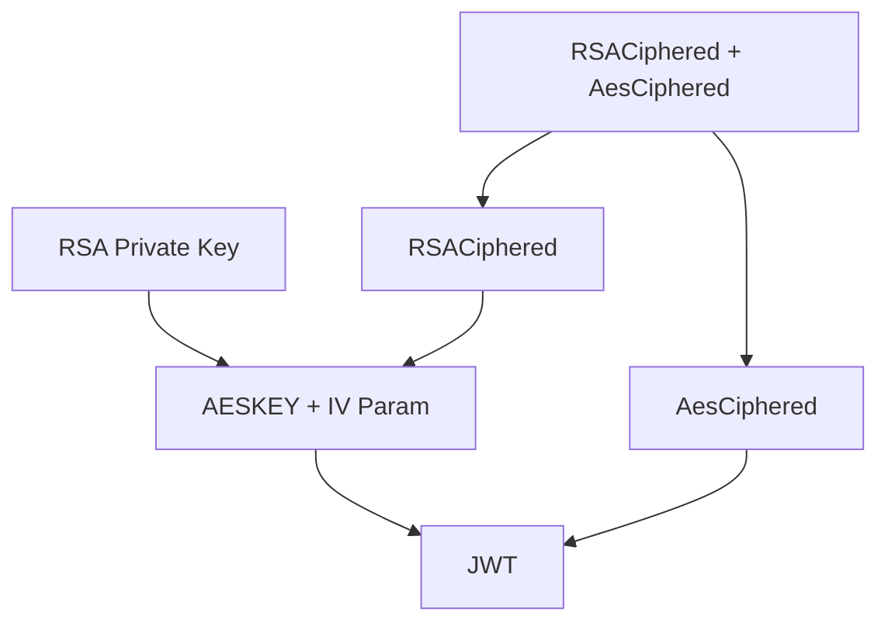

## Access NFT Token associated data (dataset catalog)

The workflow used to access NFT data contains in a data source depends on the kind of NFT we want to
access to:

* For digital passport: _Work In Progress_
* For business dataset:
    * The requester need to ask consent to the NFT data source owner. This can be done by
      calling `POST /api/v1/business-data/access-request`:
        * A transaction is made on an entry point of the smart contract.
        * The requested data source owner Collaborate instance:
            * is notified by watching the transaction made on the smart contract.
            * use the previously stored authentication process to generate access information (ex: a
              JWT on the required scope).
            * make a transaction on an entry point of the smart contract containing the cyphered
              access information.
        * The requester:
            * is notified by watching the transaction made on the smart contract.
            * decipher the access information
            * use the {data source configuration, access information} to access to the requested NFT
              related data source

#### Ciphering process:

#### Deciphering process:

