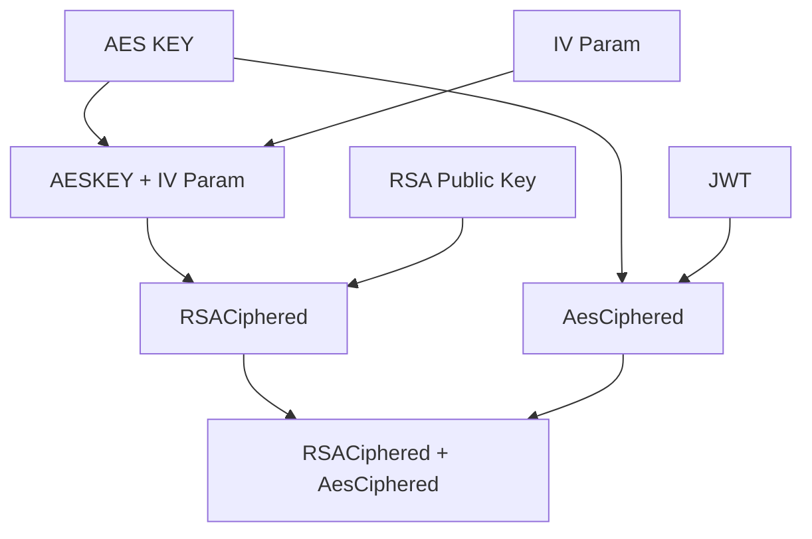
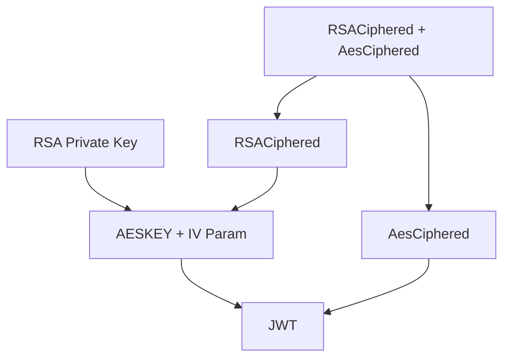

## Access NFT Token associated data (dataset catalog)

The workflow used to access NFT data contains in a data source depends on the kind of NFT we want to
access to:

* For digital passport: _Work In Progress_
* For business dataset:
    * The requester need to ask consent to the NFT data source owner. This can be done by
      calling `POST /api/v1/business-data/access-request`:
        * A transaction is made on an entry point of the smart contract.
        * The requested data source owner Collaborate instance:
            * is notified by watching the transaction made on the smart contract.
            * use the previously stored authentication process to generate access information (ex: a
              JWT on the required scope).
            * make a transaction on an entry point of the smart contract containing the cyphered
              access information.
        * The requester:
            * is notified by watching the transaction made on the smart contract.
            * decipher the access information
            * use the {data source configuration, access information} to access to the requested NFT
              related data source

#### Ciphering process:



#### Deciphering process:




### Create your _Access Token_ keys
For making other organization able to request access to the data you provide, you will need to
exchange secrets publicly. You will provide data like JWT access token, ciphered using RSA & AES
algorithms (
see: [Access NFT Token associated data](https://gitlab.com/xdev-tech/xdev-enterprise-business-network/collaborate/-/blob/develop/doc/access-nft-dataset-catalog.md)
as a more detailed overview)

* Generate your RSA keys, using a terminal:

```shell
openssl genrsa -out keypair.pem 1024 && openssl rsa -in keypair.pem -pubout -out publickey.crt && openssl pkcs8 -topk8 -inform PEM -outform PEM -nocrypt -in keypair.pem -out pkcs8.key
```

* Report your public key from the created `publickey.crt` as `encryption_key` value of your
  organization (cf. Deploy a new smart contract)
* Report your private key from the created `pkcs8.key` as `encryption_key` value of your
  organization (cf. Deploy a new smart contract)

**Deploy a new smart contract** : While working with Collaborate v0.4, you need to deploy a new
smart-contract each time you want a new organization to be added. New smart-contract strategies are
in development in next Collaborate version to avoid this annoying requirement.

Before deploying you need to update the `#### INIT ORGANIZATIONS ###` section:

* Create/update an organization by providing:
    * `legal_name`: The organization legal name
    * `address`: The organization wallet address (cf. Create a wallet)
    * `encryption_key`: The organization access token public token (cf. Create your _Access Token_
      keys)
