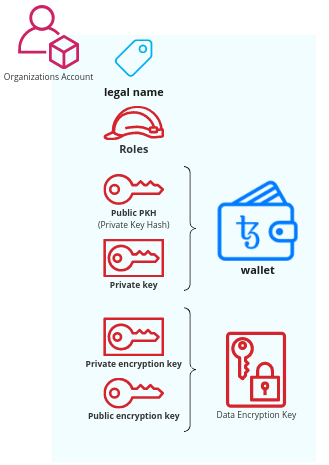
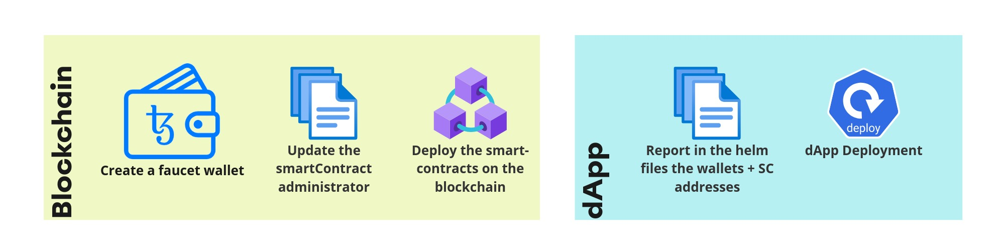
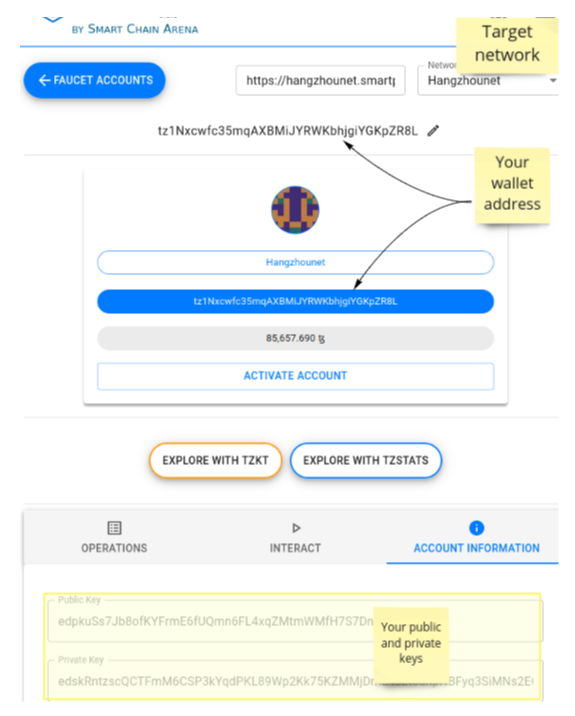
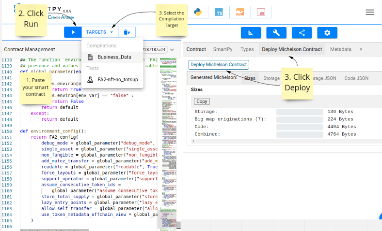
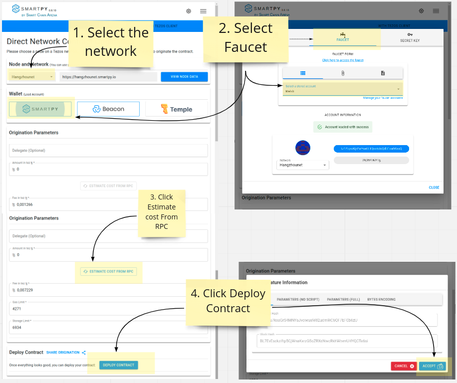
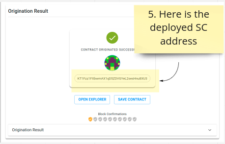
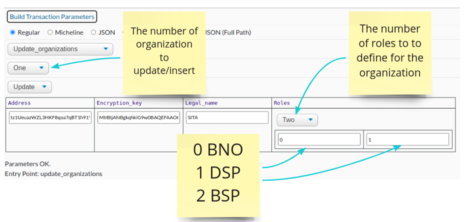
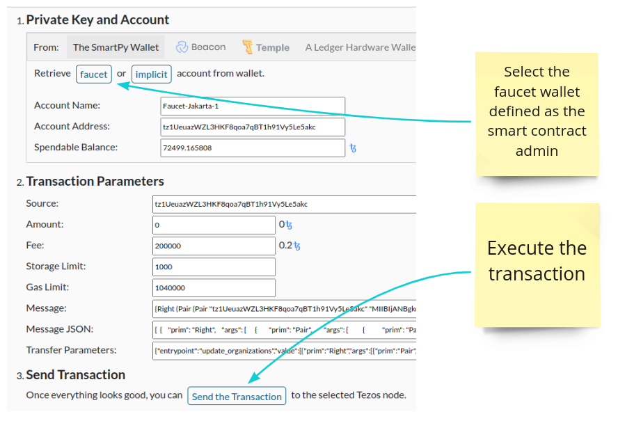

# Deploy your dApp

[[_TOC_]]

## Introduction

The Collaborate solution requires smart contracts to be deployed on a Tezos blockchain network.

For each organization member of the consortium, a dApp needs to be configured and deployed on your
infrastructure network.

### Organization consortium member



An organization is made of:

* A **legal name**: The displayable name of the organization
* A set of **roles**: These roles are used to define the rules defining the smart contract entry
  points this organization is allowed to call. These roles are represented by integers:
  Basically, it defines if the organization:
    * **0, BNO - Business Network Operator**: Used to allow the organization to add, update or
      remove
      the consortium member list.
    * **1, DSP - Data Service Provider**: Used to allow the organization create NFT.
    * **2, BSP - Business Service Provider**: Used to define the organization as a data consumer.
* A **wallet**: Used for sending transactions to the Tezos Blockchain:
    * A tezos **PKH - Private Key Hash**: The organization tezos wallet/account public address.
    * A private key: Used to signed the transactions.
* Encryption keys: Used to exchange securely access token between organizations through the
  blockchain.
    * A **public encryption key**: Used by the other organizations to exchange
      ciphered data with this organization.
    * A **private encryption key**: Used to decipher the data sent for this organization

While public data are stored inside the list of organization smart contract, the private information
are stored in a
secured [Vault](https://www.vaultproject.io/).



## Deployment steps

### Test Networks

> Mainnet is the main Tezos network, but is not appropriate for testing. Other networks are
> available to this end. Test networks usually run with different constants to speed up the chain.
>
> There is one test network for the current protocol, and one test network for the protocol which is
> being proposed for voting. The former is obviously important as users need to test their
> development
> with the current protocol. The latter is also needed to test the proposed protocol and its new
> features, both to decide whether to vote yes and to prepare for its activation. After the intended
> protocol of a test network is activated (such as Ithaca for ithacanet), the protocol no longer
> changes because this could break the workflow of some users while they are testing their
> development, as they may not be ready for the new protocol. So every time a new protocol is
> proposed
> on Mainnet, a new test network is spawned. This also makes synchronization much faster than with a
> long-lived network.
<div style="text-align: right"> <a href="https://tezos.gitlab.io/introduction/test_networks.html#test-networks">tezos.gitlab.io</a> </div>

### Create a faucet wallet

> Test networks have a list of built-in accounts with some funds. You can obtain the key to these
> accounts from a faucet to claim the funds. Faucets can be accessed from https://teztnets.xyz/.
> Each
> of the test network listed there, including the active test networks described below, have
> independent faucets.
>
> See [Get Free Tez](https://tezos.gitlab.io/introduction/howtouse.html#using-faucet) for detailed
> instructions on using a faucet.
<div style="text-align: right"> <a href="https://tezos.gitlab.io/introduction/test_networks.html#test-networks">tezos.gitlab.io</a> </div>

* Go to [Teztnets.xyz](https://teztnets.xyz/)
    * Click on the target Blockchain **network faucet link**
    * Click on `Get ꜩ` button
    * Download the generated activation key (consider using a file name
      like `tz1XXXXXXXXXXX.activation.json`)

#### Import your account

You can use [SmartPy.io](https://smartpy.io/) page for importing your account, and use this account
later for deploying smart contracts:

* Go to [SmartPy Wallet](https://smartpy.io/wallet) page:
    * Click `Faucet accounts` > `Add account`
    * Paste the **activation key**
        * Select your network
        * Click on `Activate Account` button, then on `Reveal account button
        * Click `Save Faucet` button

#### Get the wallet private and public keys

* Go back on the faucet account page and click on the Open button of the created wallet:
    * Keep your wallet address
    * You can find your wallet `private key` and wallet `public key` by clickng on
      the `Account information` tab.



### Configure and deploy the smart contracts

#### Business data

* Go to [SmartPy.io/ide](https://smartpy.io/ide)
* Copy
  the [Business Data Smart Contract](https://gitlab.com/xdev-tech/xdev-enterprise-business-network/collaborate/-/blob/develop/smart-contract/businessData.py)
  into the `Contract Management` left panel
* Edit the line above `### Origination - deployment target`:
    * Replace the `admin = sp.address("tz1..."),` with your BNO wallet address.  
      _This wallet will be defined as the smart contract administrator, and will be allowed to
      update the organization list_
* Click on the Run button
* Select the `Compilations` target
* In the right panel:
    * Click `Deploy Michelson Contract` Tab
    * Click the `Deploy Michelson Contract` button



* Follow these steps:

  
  

* Click on the `Save contract` button so SmartPy will keep this contract address for later
  use.

  _NB: SmartPy will save the address in your browser storage_

#### Yellow page

Follow the same steps as Business Data smart contract deployment using
the [Yellow Page Smart Contract](https://gitlab.com/xdev-tech/xdev-enterprise-business-network/collaborate/-/blob/develop/smart-contract/organizationsYellowPages.py)

### Generate an encryption key

> Used to exchange securely access token between organizations through the
> blockchain.
> * A **public encryption key**: Used by the other organizations to exchange ciphered data with this
    organization.
> * A **private encryption key**: Used to decipher the data sent for this organization

In a terminal, use the following command:

```
openssl genrsa -out keypair.pem 2048 \
  && openssl rsa -in keypair.pem -pubout -out publickey.crt \
  && openssl pkcs8 -topk8 -inform PEM -outform PEM -nocrypt -in keypair.pem -out pkcs8.key
```

It creates the following files:

* `publickey.crt`: The public encryption key.
* `pkcs8.key`: The private encryption key.

### Configure the organization in the deployed smart contracts

* You can interract with your smart contract by:
    * Going to [SmartPy Contracts](https://smartpy.io/wallet/smart-contracts)
        * Clicking on the `Open` button next to the **Business Data smart contract**.
        * Click on the `Explore with SmartPy` button.
    * Or directly by going on `https://smartpy.io/explorer.html?address=YOUR_SMART_CONTRACT_ADDRESS`
      .
* Scroll to **New Operation Builder**.
* Select the `update_organizations` entry point.
* Select `One`, `Update`.
* Fill the parameters with the organization information you want to add:
    * [Address](#create-a-faucet-wallet): The organization wallet address.
    * [Encryption_key](#generate-an-encryption-key): The organization public encryption key.
    * Legal_name: The organization displayable name.
    * [Roles](#organization-consortium-member): The organization roles.

  

* Continue with the below panel, where `Direct access to network` is selected:
    * Click on the `Faucet button`.
    * Select your faucet wallet previously defined as the smart contract
      administrator _[cf. Configure and deploy the smart contracts](#configure-and-deploy-the-smart-contracts)
      ._
    * Click on the `Send Transaction` button.

  
* Execute the same process with the Yellow Page smart contract.

### Configure your dApp

The application deployment configuration is handle by [Helm](https://helm.sh/) package manager
for [Kubernetes](https://kubernetes.io/).

An organization has a **helm value file** (
cf. [example](https://gitlab.com/xdev-tech/xdev-enterprise-business-network/collaborate/-/blob/develop/helm/collaborate-dapp/values-dev.yaml))
. The following properties has to be replaced by your organization values:

* `api.platform`: _**Deprecated**_ The application displayable name used when sending e-mails.
* `api.privateKey`: The organization private encryption key.
* `smartContractAddress.businessData`: The business data smart contract address.
* `smartContractAddress.organizationYellowPage`: The yellow page smart contract address.

__Sample__:

```yaml
api:
  platform: Organization name
  privateKey: MIIEvQIBADANBgkqhkiG9w0BAQEFAASCBKcwggSjAgEAAoIBAQDMSL4kM7GH4Q24Z+XuGkaVGn+JLAbsvZnWlGF9O3i8MCqL9s3ZP8GGPMyFhmtgtBeLcK9gLdY4aoqP3geLdKBiqQRnVzUyKETj7ts34OsJHXVgi0JU8vY5pz32Y7/cyrExqMf+Z8kAhlzLw/kTLqEUucZt21bq9ddzbkEuGgmhYvGCSHkj8O8ErinTN/CpFSiQSzLkVyd3LzUNlRwaeoiFovtjjxJ2F70re0R1lahABVkiCWhkDF9oUivJg6o5LqQnHMi1BEN6yXucgadBRahbRDCHer4YAx5iWXHMhMx/5OL76RA5VVVm/Kgk751Eydw6ovj3pKYUZynmOkpmQ2HrAgMBAAECggEAVJtgHNBIG9XK//AQG9BIIWLrJV3VtGFGgMfNpLdn5tEwHe3nDa5JMZamwjqM6G1OPxM5n2T8jzsZDkLP7yMrdhE4YLCOuKpS9fAsXPVLgufvgD/NBi/maLRqhkyD3ycXwlB8HFLRveToNACDfT1Xu6TBmSg51HBjfkxQtI5WJL9/VD/Pma6qxlLefXHxsGiwIvX/8NFqFJ0IuIVVimTWl329zS+57z06pCsuDKK31U4UTJM65geMwUuw6vH170uMIBWxLS8YDJdTKms669Uk3F/V2FtouFz07dHFi8Krs1vRjYfZ77lsRQTNuYlE/B3XSMKDTDsSxaXYoM6SE9GhuQKBgQDvbbtAVv6rG7iUGBc2djgiOiZjdkyrWTb4cSgoP8pP46EnDK/WXae1auX3I5P5UTmb6p3ksCNNfyBDkkXPNItgFFWcKQnPe5aEMnyxIqBLPDGOpp2337LZwbgCou7cc/shW0uhAgkr0lmuReQwHts34kbE4TKbdGmOaVHqNqr0TQKBgQDabE+KhSapnDpOBSRzl0b+BW1vGRGnXEEhQR5SQcpPGHudtANH6dqPfxx4/96cy7YdygcyPX5MMwB73qvY3+9krBRvRD++jltThl3oLefSOlBcEHsTvzc76jMI5C+7uFqzIyS+gsi5hTv3of6Q9ymyzEtgiA3ehC5AqmJ6NpirFwKBgFBrvjKtRds5c3Ui5mEfslkkyRItgTEoxUML1x411wGghtez9jf9u0A/iMDLTX+33a7WTnSrCSCVq8OmlRY1Iv+BtQO/8RClBXif8Kwa4laDAG5W3rENTWjBHcqc6bhYqKianruVEHmMrRzRUwUqyB1sPrMQpUv7/Rydmase86sdAoGADdFgTtERmxVJEvp8Tdu6IAPT4n1hgobxj9sAwg9rbwmLeHSU6I3Ax+cws+7r9Ftm0Aeh4OnG/acUVsHFeVjhWisQt+FHbxSubmBHvJJ64e/SeaCJSLyGEAJG7D8TTfrhsgd9IZhAfowROR9EbYNVXfxSoG67AeK20lx1Emo1yk0CgYEAyB5sbj1dTmaiv7vABrO1g+jltMISDvai7QeZTFC5XrGAKvgi9E3aNjOJJ1/ODE/pfpnz5PZaOzIsnJYUNJwCtg0mAdPwmgcTVt/YzmxfM8zH5pmppkKQLrpAtEm3MWwx2dnpGoUwO3PvLFXj3n18MCAdDYKi4gEqr7svEYcBb6s=

  smartContractAddress:
    businessData: KT1E5gqPrNTVZ1f8mxXhxfSNhR1Hn5iuEYVC
    organizationYellowPage: KT1Ls2zyZDWhEHVbS6y4SjAx3MWCCrnv7sCz
```