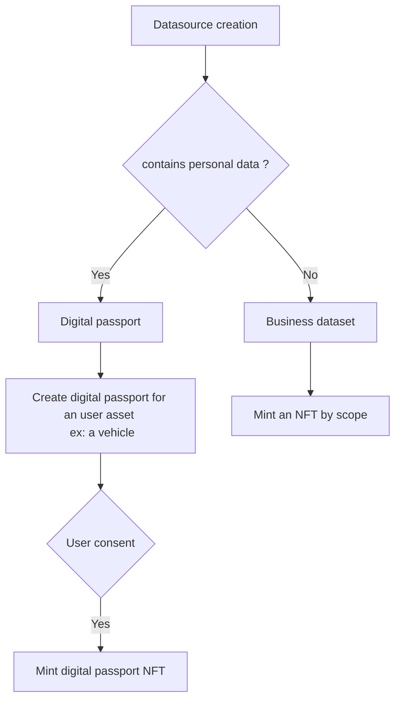
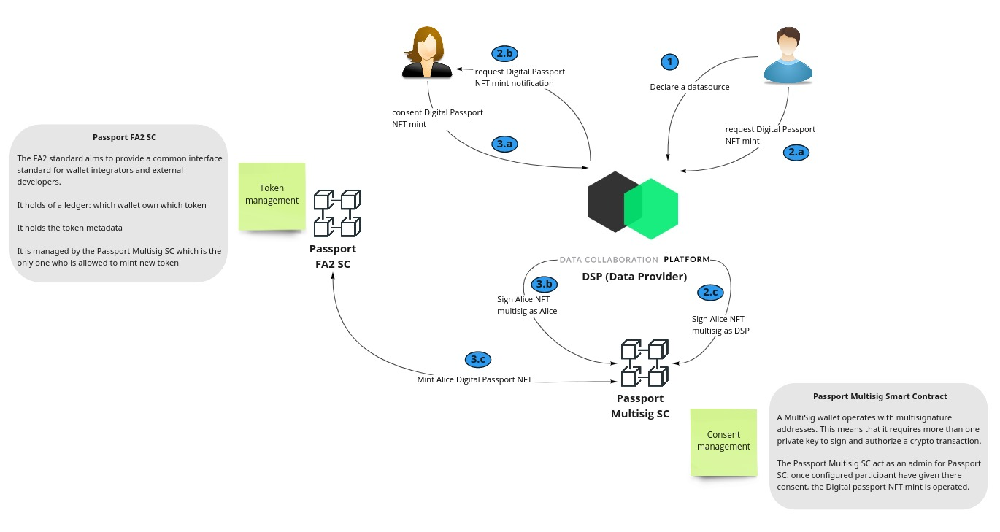
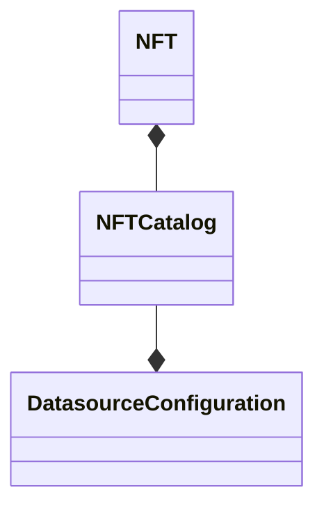

## Creating NFT Token for assets

During the creation process, when it contains personal data the owner can flag the datasource. This
flag is used to define the NTF minting workflow:

As you can see, the differences between digital passport for personal data and business dataset is:

* With personal data:
    * The datasource owner needs to ask a user to consent to the **digital passport NFT** mint by
      calling `POST api/v1/digital-passport`.
    * The user can consent by calling `POST /api/v1/digital-passport/multisig/{contract-id}`. This
      consent triggers the digital-passport NFT mint, representing a user asset.
      
* With business dataset:
    * No consent is required, the owner mint directly a **business dataset NFT** for each scope of
      the created datasource.

When a NFT is minted, it will contain metadata containing information about the datasource it is
associated to: the **NFT Catalog**.

