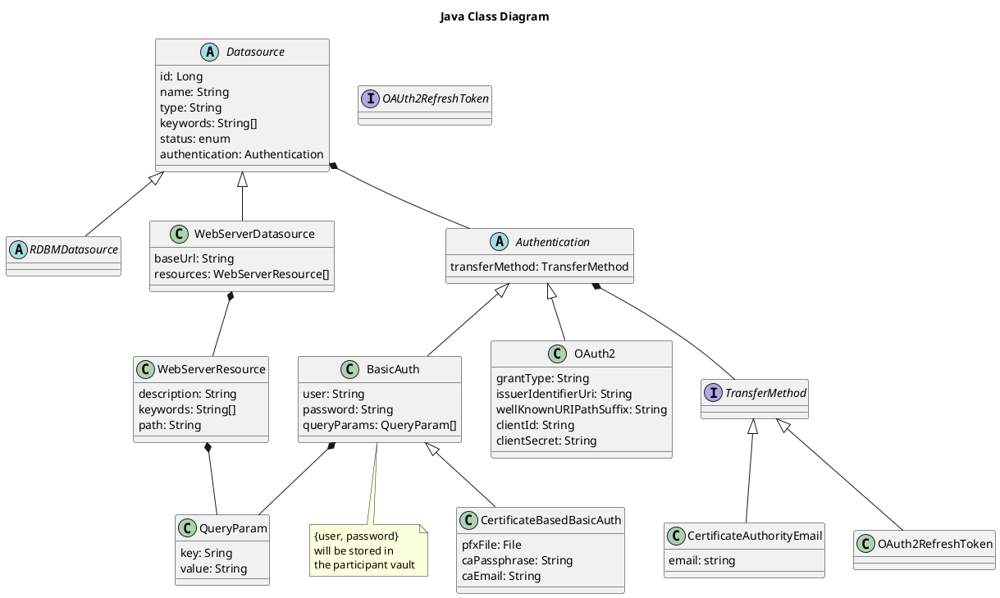

## Configuring data sources

**Data sources** is one of the core business concept the Collaborate project relies on. A Data
source is an external partner application that contains asset relative data. When a data source
owner wants to create NFT assets associated to a data source, he needs firstly to generate a http
router configuration file (aka A **data source configuration**, or
a [Traefik configuration](https://doc.traefik.io/traefik/)) by calling `POST /api/v1/datasource`.

During the creation, the owner provide **credentials** about the **authentication process** used to
access the data source. This information is cyphered and stored locally to be used when another
partner would like to access to this data source.

The data source configuration is stored in [IPFS](https://ipfs.io/) (a distributed file system), so
it could be used later by other partners to access to the NFT asset data hold by the data source.

[Scope](https://oauth.net/2/scope/) is another core business concept the data sources relies on.
Scopes are used to make able a data source to limit the resources a user can acces.

