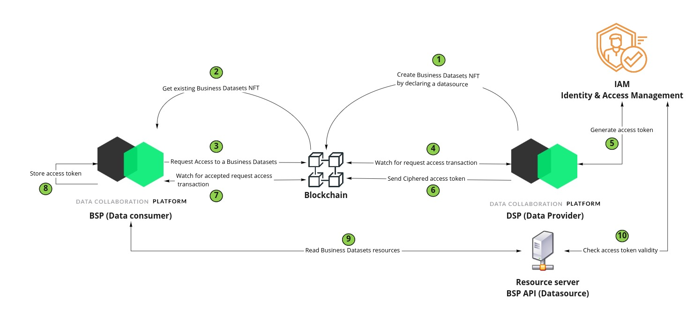

# Sharing data

## Configuring datasources

**Data sources** is one of the core business concept the Collaborate project relies on. A Data
source is an external partner application that contains asset relative data. When a datasource owner
wants to create NFT assets associated to a datasource, he needs firstly to generate a http router
configuration file (aka A **datasource configuration**, or
a [Traefik configuration](https://doc.traefik.io/traefik/)) by providing a `DatasourceDTO` as a body
of  `POST /api/v1/datasource`.

The datasource configuration is stored in [IPFS](https://ipfs.io/) (a distributed file system), so
it could be used later by other partners to access to the NFT asset data hold by the datasource.

[Scope](https://oauth.net/2/scope/) is another core business concept the datasources relies on.
Scopes are used to make able a datasource to limit the resources a user can access.

### Authentication process

During the creation, the owner provides **credentials** and other information required about the
**authentication process** used to access the datasource. In the bellow
samples [OAuth 2.0 Client Credentials Grant](https://oauth.net/2/grant-types/client-credentials/) is
defined by `type` and `grantType` fields. The `authorizationServerUrl` field is used for getting a
valid token whe needed using credentials defined by `clientId`
and `clientSecret` fields. Authentication information is cyphered and stored in your dApp instance ,
it will be used to generate access token when another partner would like to request access to this
datasource[^1]. The `partnerTransferMethod` field define the strategy to use in a such process

#### Future orientations

Currently  [OAuth 2.0 Client Credentials Grant](https://oauth.net/2/grant-types/client-credentials/)
is the only implemented authentication mechanisms.
_Basic Auth_ and _Certificate Based Basic Auth_ are also available for experimentation purpose. More
authentications mechanisms should be available in future versions

[^1]: [Access data associated to NFT Token (dataset catalog)](access-nft-dataset-catalog.md)

### Resources

The `resources` field is used for describing the mapping between an entry-point and the kind data it
exposes for an asset.

A resource _Battery level_ is defined in the bellow _dsp-b_ sample. It explains that a call to the
datasource `/battery/$1` entry-point (where `$1` defines a path parameter as a placeholder for an
asset id) while results in `metric:battery` information for the asset identified by `$1` path
parameter value.

##### The `list-asset` required resource

When defining a datasource, there is an expected mandatory resource having `keyworlds` field
containing `list-asset` to be defined. This resource is used to test if Collaborate API succeeds in
communicating with the datasource. In the bellow _dsp-b_ sample, it expects a `GET /vehicle` to
results with an _HTTP 200 OK_ status code.

##### Experimental

The `metadata:value.jsonPath:` keyword prefix value is an experimental feature for defining a
mapping to be applied on the response data.

## Play with demo datasource

To illustrate datasource usage, XDev provide a [simple API](https://dsp-a.fds.pcc.eniblock.fr) that
you can use for testing your first datasource creations.

[Find here the Behavior Driven Development feature](../../pcc/doc/features/datasource/business-data.create-datasource.feature.md)
