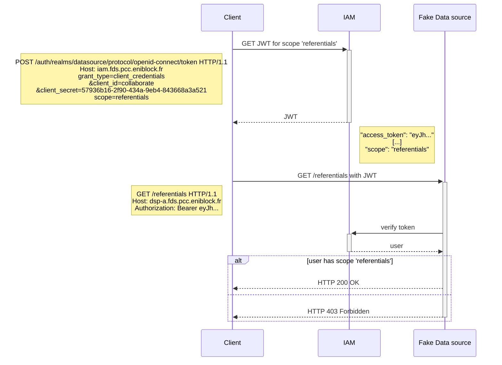

```mermaid
sequenceDiagram
    participant C as Client
    participant I as IAM
    participant F as Fake Data source
    C ->>+ I: GET JWT for scope 'referentials'
    Note left of C: POST /auth/realms/datasource/protocol/openid-connect/token HTTP/1.1 <br/>Host: iam.fds.pcc.eniblock.fr<br/>grant_type=client_credentials<br/>&client_id=collaborate<br/>&client_secret=57936b16-2f90-434a-9eb4-843668a3a521<br/>scope=referentials

    I -->>- C: JWT
    Note right of I: "access_token": "eyJh..."<br/>[...]<br/>"scope": "referentials"<br/>

    C ->>+ F: GET /referentials with JWT
    Note left of C: GET /referentials HTTP/1.1 <br/>Host: dsp-a.fds.pcc.eniblock.fr<br/>Authorization: Bearer eyJh...
    
    F ->>+ I: verify token
    I -->>- F: user
    alt user has scope 'referentials'
      F-->>C: HTTP 200 OK  
    else
      F-->>-C: HTTP 403 Forbidden
    end
```
