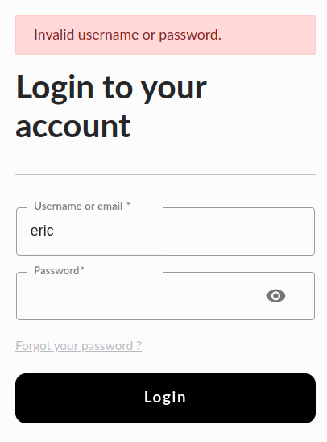

# Feature: Organization Admin First Login

As Eric, an identity provider administrator of an organization “orgA”, 

I want to use pre-defined credentials 

So that I can log into the Governance APP for the first time.

## Background:

**Given** The following users and credentials

| username | e-mail             | password | role                                    |
|----------|--------------------|----------|-----------------------------------------|
| eric     | eric@idp-admin.com | admin    | service_identity_provider_administrator |

## Scenario: Login using valid credentials

Given Eric is on the login page of the “orgA” dApp

When he fills the “username” field with “eric" value

And he fills the “password” field with “admin” value

And Eric click on the “Login” button

Then Eric is redirected to the governance page And he sees the navigation menu

## Scenario: Login using invalid credentials

Given Eric is on the login page of the “orgA” dApp

When he fills the “username” field with “eric" value

And he fills the “password” field with “invalid” value

And Eric clicks on the “Login” button

Then Eric sees “Invalid username or password” error message

