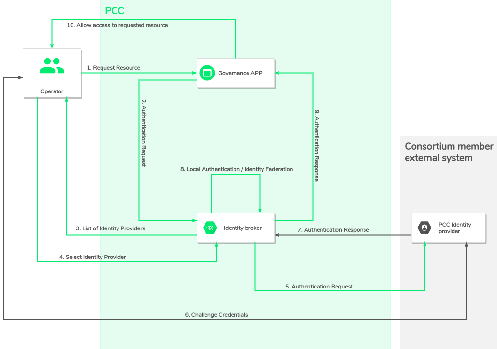

## Identity Federation

see: [User identity federation](https://xdevtechnologies.atlassian.net/wiki/spaces/DA/pages/524943776/Partners+APP+-+User+admin+and+opeators+Identity+Federation#Technical-design)
-_XDev project Confluence space_

**Collaborate** use **[Keycloak](https://www.keycloak.org/)** as an **Identity broker** to make
users able to work with identity providers from which he can authenticate using his organization
credentials.

> _An **Identity Broker** is an intermediary service that connects multiple service providers with
different identity providers. As an intermediary service, the identity broker is responsible for
creating a trust relationship with an external identity provider in order to use its identities to
access internal services exposed by service providers._



### Configuring Keycloak

The running keycloak instance is the
an [XDev - Keycloak](https://gitlab.com/the-blockchain-xdev/xdev-product/enterprise-business-network/keycloak)
container image. During development cycle,
the [Keycloak Administration console user interface](https://col.localhost/auth/admin/master/console/#/realms/collaborate-dapp)
can be used for configuration and test purposes using Keycloak Admin credentials:

* Open **Lens**
* In _Workloads / Pods_, select the pod named `col-keycloak-0`, in the right panel you will find the
  Admin user credentials as environment variables:
    * **user**: `KEYCLOAK_ADMIN_USER`
    * **password**: `KEYCLOAK_ADMIN_PASSWORD`

### Identity administrator onboarding

While deploying your application instance for the first time, you will need to define a first _
identity admin user_  to configure how others users will connect to your application.

* Use predefined _identity admin_ (aka
  Eric) [available user](https://gitlab.com/xdev-tech/xdev-enterprise-business-network/collaborate/-/blob/develop/doc/iam.md#identity-federation)
  .
* Configure an identity provider
* Ask one of your organization user (aka. Fabian) to make a first login using the configured
  identity provider.
* Use the _Eric_ account to update _Fabian_ roles with the _Service identity provider administrator_
  role.
* Disable all the predefined users, and so only _Fabian_ account can access your application until
  new users make a first login and _Fabian_ give them a role (or they already have a default role if
  a role mapper has been configured with the organization identity provider).

### Connect Identity Provider

As Keycloak is an Identity Broker it is possible to define multiple Identity Providers (e.g. Google,
GitHub...) in its configuration. There is multiple ways to add an Identity provider into your
Keycloak instance :

* Use
  the [Keycloak Administration console user interface](https://col.localhost/auth/admin/master/console/#/realms/collaborate-dapp):
    * According
      to [Keycloak Official Documentation](https://www.keycloak.org/docs/latest/server_admin/#_identity_broker)
      you can follow step described to integrate the Identity Provider of your choice.
* Pre-configure the [Keycloak realm configuration file](../dapp/iam/realm-config/realm.json):
    * You can provide a list of identity provider following
      the [Keycloak Identity Provider Representation](https://www.keycloak.org/docs-api/15.0/rest-api/index.html#_identityproviderrepresentation)
* Use The Keycloak Rest-API:
    * By using
      the [Keycloak Rest-API](https://www.keycloak.org/docs-api/15.0/rest-api/index.html#_identity_providers_resource)
      . You will first need to retrieve a JWT for the keycloak admin user (
      cf. [Get a JWT](#get-a-jwt)). Following example illustrate how to add a GitHub provider.

```
curl --location --request POST 'http://psa.localhost/auth/admin/realms/collaborate-dapp/identity-provider/instances' \
--header 'Authorization: Bearer {{YOUR_JWT_ACCESS_TOKEN_GOES_HERE}}' \
--header 'Content-Type: application/json' \
--data-raw '{
    "alias": "xdev-github",
    "displayName": "Login with XDev GitHub",
    "providerId": "github",
    "enabled": true,
    "updateProfileFirstLoginMode": "on",
    "trustEmail": true,
    "storeToken": false,
    "addReadTokenRoleOnCreate": false,
    "authenticateByDefault": false,
    "linkOnly": false,
    "firstBrokerLoginFlowAlias": "first broker login",
    "config": {
        "syncMode": "IMPORT",
        "clientSecret": "<<CLIENT_SECRET>>",
        "clientId": "<<CLIENT_ID>>",
        "guiOrder": "0",
        "useJwksUrl": "true"
    }
}'
```

#### Role mapping: Define a default user role for user authenticated from identity provider

You can define a default role to users that come from an external identity provider by defining a
role mapper:

```
curl --location --request POST 'http://psa.localhost/auth/admin/realms/collaborate-dapp/identity-provider/instances/github/mappers' \
--header 'Authorization: Bearer {{YOUR_JWT_ACCESS_TOKEN_GOES_HERE}}' \
--header 'Content-Type: application/json' \
--data-raw '{
  "name": "default pending_asset_owner for github",
  "identityProviderAlias": "xdev-github",
  "identityProviderMapper": "oidc-hardcoded-role-idp-mapper",
  "config": {
    "syncMode": "IMPORT",
    "role": "pending_asset_owner"
  }
}
'
```

### Get a JWT

The initial user configuration is made by customizing
the [Keycloak user configuration file](../dapp/iam/realm-config/users-0.json). Pre-configured users
and roles are available:

| username | e-mail                 | password | roles                                   |
|----------|------------------------| ------- |-----------------------------------------|
| Eric     | eric@idp-admin.com     | admin | service_identity_provider_administrator |
| Sam      | sam@dsp-admin.com      | admin | data_service_provider_administrator     |
| David    | david@bsp-operator.com | admin | business_service_provider_operator      |
| Paul     | paul@bsp-admin.com     | admin | business_service_provider_administrator |
| Gabriel  | gabriel@bno.com        | admin | business_network_operator               |

Collaborate define a pre-configured `frontend` **OpenID Connect Client** using `openid-connect`
protocol for single-sign-on.

To get a JWT token you can make a request:

```
curl --location --request POST 'https://col.localhost/auth/realms/collaborate-dapp/protocol/openid-connect/token' \
--header 'Content-Type: application/x-www-form-urlencoded' \
--data-urlencode 'grant_type=password' \
--data-urlencode 'username=sam' \
--data-urlencode 'password=admin' \
--data-urlencode 'client_id=frontend'
```

## User roles

The target user roles definition is available on
the [Stakeholders and user roles - XDev Collaborate Confluence page](https://xdevtechnologies.atlassian.net/wiki/spaces/DA/pages/167870813/Stakeholders+and+user+roles)
