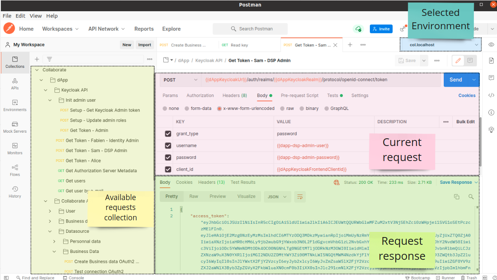

# Accessing and testing the Collaborate application with Postman

The application is available on `https://col.localhost`. You can also access to
the [OpenAPI of your local instance](https://col.localhost/api/swagger-ui/index.html?configUrl=/api/api-docs/swagger-config)

A [Postman](https://www.postman.com/) collection can be imported to test the
API: [Collaborate.postman_collection.json](../postman/Collaborate.postman_collection.json) . The
most relevant requests are defined under `dApp/Collaborate API` and `dApp/Keycloak API`.
_Other collection sub-folders are used during development to make developers able to interact with
underlying components._

Import also
the [col.localhost.postman_environment.json](../postman/col.localhost.postman_environment.json)
environment

### JWT

The API entry-points are restricted to specific roles (
cf. [Roles and permissions](https://xdevtechnologies.atlassian.net/wiki/spaces/DA/pages/513605692/GDPR+compliance#Roles-and-Permissions))
and so a [JWT](https://jwt.io/) has to be used as a _Bearer Token_. You can get a token by calling
the Security API: use the predefined Postman
request `Collaborate/Keycloak API/Get Token - Sam - DSP Admin`. Postman will automatically keep the
JWT and reuse it in further predefined requests.

