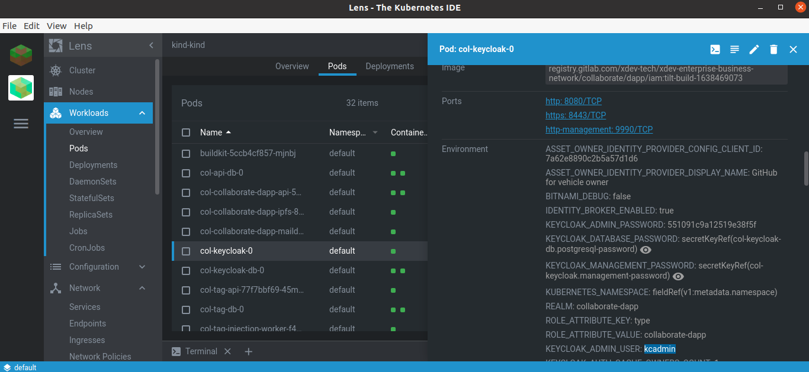
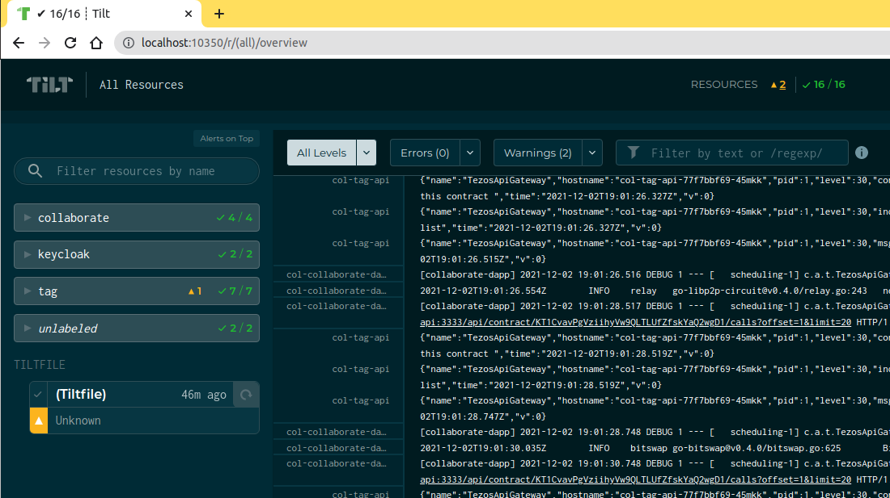

## Run your environment

- [Install Docker](https://docs.docker.com/engine/install/#server):
    - [x] Ensure your docker service is available for your current user:`docker ps`.

      If the service is not available, please refer
      to [Docker post installation steps](https://docs.docker.com/engine/install/linux-postinstall/#manage-docker-as-a-non-root-user)
      .

      (!) Once you have added your user in the `docker` group, restarting your computer will ensure
      your user to access to the docker service.

- Install your local kubernetes cluster:
    - [Install clk k8s](https://github.com/click-project/clk_recipe_k8s).
    - Close and open a new terminal.
    - Execute the `clk k8s flow` command to create your cluster. It can take some minutes before
      ending with the following message:
      ```
      Ended executing the flow dependencies, back to the command 'flow'
      Everything worked well. Now enjoy your new cluster ready to go!
      ```
    - [x] Check that tilt has been installed by using `tilt version`: you should get a response
      like `v0.22.7, built 2021-09-03`.
    - [ ] Optionnaly you can setup [Lens](https://k8slens.dev/) to get additional information about
      your deployed K8S cluster
      
- Update your `sysctl` config:
    - Edit the `/etc/sysctl.conf` file
    - Add the following content:
    ```
    fs.inotify.max_user_watches = 5242880
    fs.inotify.max_user_instances = 5120
    ```
    - Execute `sudo sysctl -p`:
- [Install git](https://git-scm.com/downloads).

- Clone the Collaborate project
  repository: `git clone https://gitlab.com/xdev-tech/xdev-enterprise-business-network/collaborate.git`

- On Dev environements, [Tilt](https://docs.tilt.dev/) is used to simplify the containers
  orcherstration: go to the Collaborate project folder and run the application using the `tilt up`
  command, then press `space` key on your keyboard to
  open [Tilt in your browser](http://localhost:10350/r/(all)/overview).
- [x] Wait until all the Tilt resources get a green state. Warns (yellow state) could occurs but
  errors (red state) should not.
  _It will take time the first time to download all the project dependencies. You can stop the
  application by using the `tilt down` command_
  

### Troubleshooting

#### CLK K8S: ModuleNotFoundError: No module named 'distutils.cmd'

If you get the following error message while installing clk K8S:

```
ModuleNotFoundError: No module named 'distutils.cmd'
installing pip... done
Traceback (most recent call last):
  File "<string>", line 3, in <module>
ModuleNotFoundError: No module named 'pip'
Error: we could not install a suitable pip version...
```

Then, execute the `apt-get install python3-distutils` command and execute
again `curl -sSL https://clk-project.org/install.sh | env CLK_EXTENSIONS=k8s bash`
